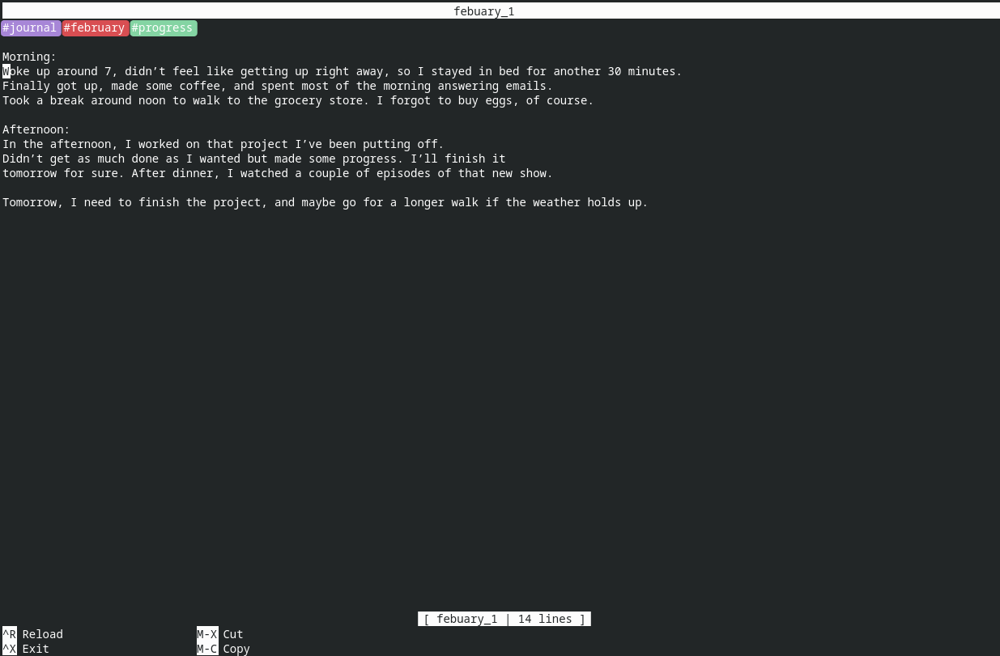

# NanoJournal

A minimalistic, [heavily] GNU nano inspired journaling Webapp.

## Motivation

I wanted to start daily journaling and didn't find a app I liked. It had to be:

- Minimalistic and lightweight
- Super quick to use
- Have excellent keyboard support
- Work on all of my devices

This projects tries to eventually achieve all 4 things.

## Current State

Currently the project is in an super early prototype state.
It was written in 2 Days during a School week, totaling to 7 hours.
It lacks most of the advanced features listed above, but should demonstrate easy of use!

## Roadmap

- [x] Scrolling (quite the basic feature, right ?)
- [x] Syncing across devices (A deno.js backend server with sqlite)
  - [x] Deno backend
  - [x] Rewrite frontend file handling
- [x] Tags
  - [x] Frontend support
  - [ ] Backend support
- [ ] Bug fixes
  - [ ] Text selection
- Mouse support
- [x] A mobile friendly interface (as long as you use a keyboard :D)

## Screenshots

